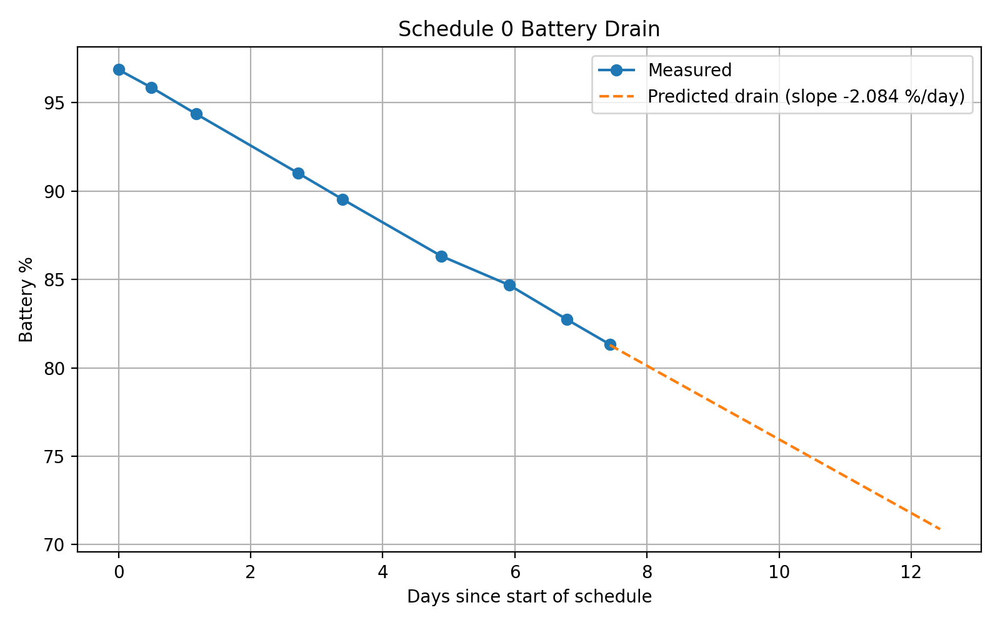

# Battery

## Overview

Battery charge levels when not connected to the optional solar system were tested over 1 month with three different recording schedules. It was shown to drain at about 1.5-2 % per day, and is projected to provide about 50 days of power. There is no evidence that the number of recording bouts, recording length, or total daily recording time produce a meaningful change in the battery drain rate. The variation observed is consistent with noise and environmental effects, not meaningful power differences. This is also consistent with documentation provided by Instinct Environmental.&#x20;

With the solar module connected, we can expect the ASU 2 to be able to power itself unattended in the field for a full year or longer - even under less than ideal conditions such as light shade or extended periods of cloudy weather.

### Calculating battery

The ASU 2 does not monitor or provide the user with any information about battery charge. There is no display of battery percentage remaining remotely, or on the physical device. For this reason I installed a shunt-based monitor to the battery. More specifications for the battery monitor/setup can be found[ below](https://open-2v.gitbook.com/~space/H1ycAoAevOxVGyrDiWwK/~gitbook/pdf?back=false#pdf-page-nciHy9ZD1pT3FMUeNLra-battery-specs).

I tested using 3 different schedules with various recording lengths and amount of recordings per day.

### Results (without solar)

<table><thead><tr><th width="100.33331298828125">Schedule</th><th>Recording schedule</th><th>Recording time</th><th width="158.60009765625">Battery Drain/day</th><th>Days to empty</th></tr></thead><tbody><tr><td>0</td><td>every 20 min (72 per day)</td><td>5 min each (6 hrs/day)</td><td>26.7 Wh/day -2.084 % per day</td><td>48 days</td></tr><tr><td>1</td><td>every 30 min (48 per day)</td><td>10 min each (8 hrs/day)</td><td>20.7 Wh/day -1.616 % per day</td><td>62 days</td></tr><tr><td>2</td><td>00:02, 06:00, 12:00, 18:00 (4 per day)</td><td>5 hours each (20 hrs/day)</td><td>27.3 Wh/day -2.129 % per day</td><td>47 days</td></tr></tbody></table>

<figure><figcaption></figcaption></figure>

<figure><figcaption></figcaption></figure>

<figure><figcaption></figcaption></figure>

Full Battery Data:



### Battery specs

* Nominal: **12.8 V 100 Ah** LiFePO₄
* Usable capacity ≈ **100 Ah × 12.8 V = 1280 Wh**

### Calculating battery

$$
\text{Battery \% Remaining}
=
100
-
\left(
\frac{\text{Energy}_{\text{Wh (PZEM)}}}{1280}
\times 100
\right)
$$

***

Shunt Specs

* Measuring Accuracy: 1%
* Power Consumption: 0.2W
* Measurement speed: 2 times/s
* Active Power test range: 0\~10kW
* Energy test range: 0\~9999kWh
* Voltage test range: DC 6.5\~100V
* Current test range: 0\~ 100A

### Shunt Setup:

<figure><figcaption></figcaption></figure>
