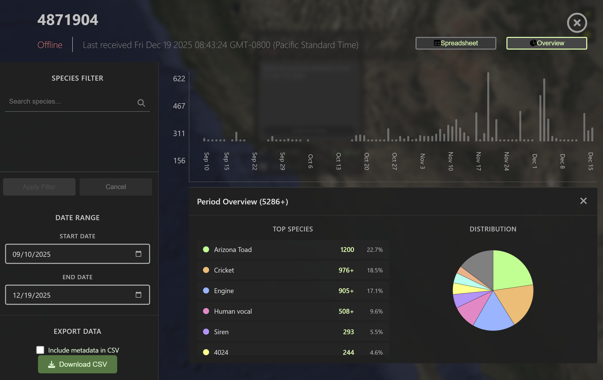

# Satellite Data Relay

Acoustic analyses are reliably sent to the website portal quickly (within \~6 minutes) after processing a given recording slot on the ASU2.&#x20;

It should be noted that during a given recording window processing only happens after recording is finished, they cannot be done concurrently. Because of this we describe the analysis of audio recordings as near real-time. This means that the speed of notification delivery is tied to the recording window duration.

For short recording windows - such as 5 minutes, we could expect to receive notification of a frog call within 15 minutes of the actual vocalization in the field. If using an 8 hour recording window, a bullfrog calling at the beginning of that window will not notify the user until \~ 9 hours later (8 hours recording time + 51 minutes processing + 8 minutes phone latency).

It should be noted that the documentation states "Globalstar (the satellite provider) purports that 99.1% of all transmissions will be successful, so even in perfect conditions, there is a small chance that a transmission will be unsuccessful". No such instances were found during our testing.

***

## Instinct Environmental Web Application Portal

Detections from devices deployed din the field can be accessed via Instinct's web application at [https://instinctenvironmental.web.app/](https://instinctenvironmental.web.app/).&#x20;

For each recording unit, you can remotely view detections from the latest satellite transmissions.&#x20;

<figure><figcaption></figcaption></figure>

The web app allows filtering by date range, and species.

<figure><figcaption></figcaption></figure>

Data can be displayed as a chart or a spreadsheet, which can be downloaded as csv. The spreadsheet includes options to include additional fields, namely;

* Storage Used
* Schedule ID
* Air Temperature
* Relative Humidity
* Soil Temperature
* Rainfall
* Wind Direction
* Wind Speed

<figure><figcaption></figcaption></figure>

***

## Alert Latency Metrics

Calculated as the amount of time between the ASU finishing processing and the user receiving a notification. This includes the time for satellite transmission to Instinct's database, and its alert system sending out the notification.

| Channel | Mean        | Std         |
| ------- | ----------- | ----------- |
| Email   | 8.0 minutes | 5.9 minutes |
| Text    | 8.0 minutes | 5.9 minutes |
| Phone   | 7.9 minutes | 6.2 minutes |

### Processing time:&#x20;

**Processing Time Per Minute of Recording:**

* **Algorithm 1** (PNW-Cnet): **0.042 minutes** (2.52 seconds)
* **Algorithm 2** (BirdNET): **0.17 minutes** (10.2 seconds)
* **Algorithm 3** (Both): **0.212 minutes** (12.72 seconds)

**For our examples:**

**5 hours of recording (300 minutes):**

* PNW-Cnet: 300 × 0.042 = **12.6 minutes**
* BirdNET: 300 × 0.17 = **51 minutes**
* Both: 300 × 0.212 = **63.6 minutes**

**10 minutes of recording:**

* PNW-Cnet: 10 × 0.042 = **0.42 minutes**&#x20;
* BirdNET: 10 × 0.17 = **1.7 minutes**
* Both: 10 × 0.212 = **2.12 minutes**&#x20;
