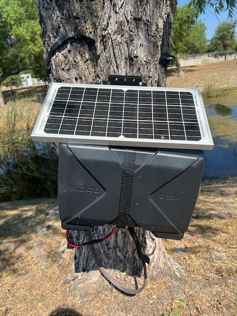
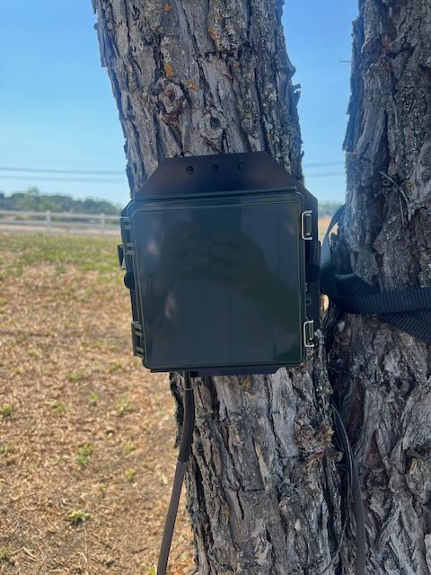
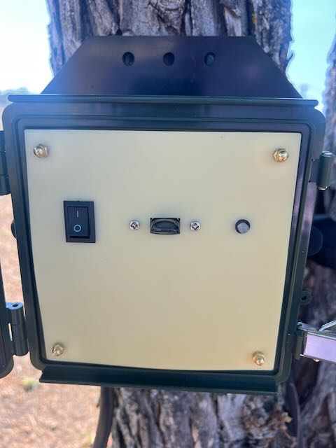
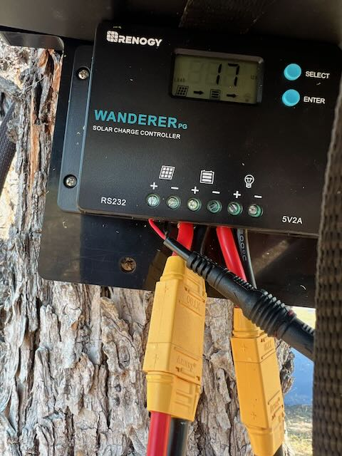

# Field Guide

This section provides a general overview of lessons learned during deployment and maintenance of the ASU2 in the field. For in depth documentation please refer to the full user guide from Instinct Environmental: [https://docs.google.com/document/d/1JrXlkBNLy5zbhXjEVzXjsKxHEMzv7dOoig-mSg38msU/edit?tab=t.0](https://docs.google.com/document/d/1JrXlkBNLy5zbhXjEVzXjsKxHEMzv7dOoig-mSg38msU/edit?tab=t.0)

## Initial Setup (tree mounting method)

To deploy the ASU2 in the field the user will need the ASU2 device, battery, mounting plate, ratchets, USB drive, and solar panel. The USB drive should be pre-loaded with the desired recording schedule. **It is recommended that the device is allowed to run and test for one week at home before it is deployed in the field to ensure that the device and associated component are not faulty.**

The user will mount the ASU2 to a sturdy tree trunk with via cloth crank ratchets, with the solar panel attached - facing South. The solar panel and battery w case should also be mounted on the same tree or can be placed on the ground beside the device. Connect 3 sets of wires as per the guide (connection points are set up such that they cannot be connected incorrectly). Please note the battery is very heavy, use care when attaching it to the mount.&#x20;

Whenever possible avoid exposing the ASU2 device to high temperatures, if possible mount it to a north facing side of a tree. The solar panel and battery can be exposed to heat and sun without any negative impacts.&#x20;

After the set up is complete, start the device only requires plugging in the USB drive, and flipping the switch to 'on'. In the case of any issues, check the [user guide](https://docs.google.com/document/d/1JrXlkBNLy5zbhXjEVzXjsKxHEMzv7dOoig-mSg38msU/edit?tab=t.0) for debugging options.

### Maintenance/Data Retrieval - two methods

Laptop Option

1. Turn off the device.&#x20;
2. Remove the USB drive and connect to the computer.
3. Download any data, upload a new schedule if desired (delete the old file).
4. Reconnect USB drive and power on device.

USB Swap Option (requires a second USB drive)

1. Install new schedule to second USB drive before going to the field.
2. Turn off device, swap USB drives and power on again.
3. Take original USB drive to workstation for data retrieval.

When in the field, maintenance would include cleaning the solar panel of any debris that might have accumulated blocking the signal. If solar is not used, the battery may need to be charged which would require bringing it somewhere with ample power supply to charge, before returning it to the field.

<figure><figcaption>
Solar Panel Mounted to Plastic Backing Panel along with the battery. Place facing south with as much direct sun exposure as possible.  
</figcaption></figure> <figure><figcaption>
ASU2 placed in the shaded side of the tree, opposite of the solar panel which needs as much direct sun as possible. 
</figcaption></figure> <figure><figcaption>
ASU2 with panel cover open. The button on the left is the on/off switch, USB drive is in the middle. The Indicator light is on the right. 
</figcaption></figure> <figure><figcaption>
Solar Power Regulator. Note that cable layout is designed to prevent mistaken connections.
</figcaption></figure>

