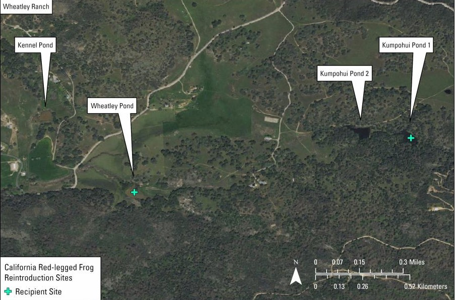

# Audio Data Split Design

### Data Preparation

21,887 3-second audio files were collected and manually verified for the purpose of training and testing these models. All files were split into positive or negative (presence/absence of RADR vocalization). All positive files were further sorted into 'high', 'medium' or 'low' quality, and 'grunt', 'growl', or 'both' vocalization types.

All original audio data was already formatted as, or preprocessed into, 3-second files at 48 kHz, 16 bit, mono, WAV files.

### General Analysis

To ensure reliable training and robust evaluation of the acoustic classifier, we established a fixed data split strategy.

* **Out-of-Distribution (OOD) Test — Sylvan Pond (Moth11 + Moth12):**\
  All audio from Sylvan Pond was held out as a **site-exclusive test set**. This ensures that model evaluation includes a “different site” condition, capturing domain shift effects (e.g., background acoustics unique to Sylvan).\
  → This provides a strict measure of real-world generalization. (1691 positive, 1894 negative)
* **In-Distribution (IID) Test (8% of date blocks):**\
  Dates were deterministically selected from each recorder and site (excluding Sylvan). This guarantees that evaluation clips come from **different days** than training, preventing temporal leakage while still being from the same environments.\
  → Provides a fair estimate of performance under conditions similar to training. (1964 positive, 979 negative)
* **Validation (15% of date blocks):**\
  Dates were held out from each recorder/site for hyperparameter tuning and threshold selection. The larger validation fraction (647 positives, 2602 negatives) ensures stable and representative evaluation during model development.
* **Training Set:**\
  The remaining data (3585 positives, 8525 negatives) forms the training pool. This ensures the model sees the majority of available calls while retaining enough variety in validation/test to evaluate robustness.

#### Why This Works

* **Leakage Prevention:** Entire date blocks are assigned to one split only — no mixing of clips from the same night between train/val/test.
* **Generalization Check:** The OOD test set from Sylvan Pond isolates an entire site for evaluation.
* **Balanced Representation:** All splits contain low/medium/high quality calls and all call types (grunt, growl, both).
* **Precision-Oriented:** By retaining a large negative pool in val/test, evaluation directly stresses the model’s ability to avoid false positives.
* **Reproducibility:** Splits are deterministic (stable hash), ensuring the same assignments every run.

***

## Splits by Location

* **OOD (Sylvan Pond)** — _Moth11 + Moth12_
  * Positives: 1,691
  * Negatives: 1,894
  * ➝ Fully reserved as the out-of-distribution (OOD) test set.
* **Cole Creek (Moth08)**
  * Positives: 2,765 (train) + 547 (val) + 406 (test\_iid) = **3,718**
  * Negatives: 2,731 (train) + 1,110 (val) + 4 (test\_iid) = **3,845**
  * ➝ Largest single contributor outside OOD, well-balanced across splits.
* **Rancho Meling (Moth13)**
  * Positives: 381 (train) + 40 (val) + 1,523 (test\_iid) = **1,944**
  * Negatives: 4,347 (train) + 1,181 (val) + 38 (test\_iid) = **5,566**
  * ➝ This data is from the source site in Baja California, Mexico.
* **Wheatley Pond / Stream (Moths 01–07, 09–10)**
  * _Moth01:_ 31 pos (train) + 31 pos (val) + 7 pos (test\_iid) = **69 pos**
  * _Moth02:_ 2 pos (train) + 2 pos (val) + 1 pos (test\_iid) = **5 pos**
  * _Moth03:_ 79 pos + 952 neg (train), 17 pos (val), 12 pos (test\_iid) = **108 pos / 952 neg**
  * _Moth04:_ 197 pos + 200 neg (train), 6 pos + 2 neg (val), 3 pos (test\_iid) = **206 pos / 202 neg**
  * _Moth06:_ 130 pos + 23 neg (train), 4 pos (val), 12 pos (test\_iid) = **146 pos / 23 neg**
  * _Moth07:_ 26 neg (train), 159 neg (val), 106 neg (test\_iid) = **291 neg**
  * _Moth09:_ 246 neg (train), 93 neg (val), 200 neg (test\_iid) = **539 neg**
  * _Moth10:_ 57 neg (val), 631 neg (test\_iid) = **688 neg**
  * ➝ Smaller contributions relative to Cole Creek and Rancho Meling, but they ensure representation from diverse devices and sites across splits.

<figure><figcaption></figcaption></figure>

<figure><figcaption></figcaption></figure>

<figure><figcaption></figcaption></figure>

***

### Detailed Data Breakdown

Below is the specific distribution of audio clips by split. Counts reflect the number of 3-second audio clips in each category.

#### Totals per Split

| Split    | Positives | Negatives | Total  |
| -------- | --------- | --------- | ------ |
| Train    | 3,585     | 8,525     | 12,110 |
| Val      | 647       | 2,602     | 3,249  |
| Test-IID | 1,964     | 979       | 2,943  |
| Test-OOD | 1,691     | 1,894     | 3,585  |

***

#### Positives by Quality

| Split    | High | Medium | Low   |
| -------- | ---- | ------ | ----- |
| Train    | 245  | 1,772  | 1,568 |
| Val      | 2    | 101    | 544   |
| Test-IID | 270  | 473    | 1,221 |
| Test-OOD | 109  | 625    | 957   |

***

#### Positives by Call Type

| Split    | Grunt | Growl | Both  |
| -------- | ----- | ----- | ----- |
| Train    | 2,020 | 170   | 1,395 |
| Val      | 285   | 25    | 337   |
| Test-IID | 1,325 | 58    | 581   |
| Test-OOD | 1,017 | 136   | 538   |

***

The full audio data manifest can be found here:


