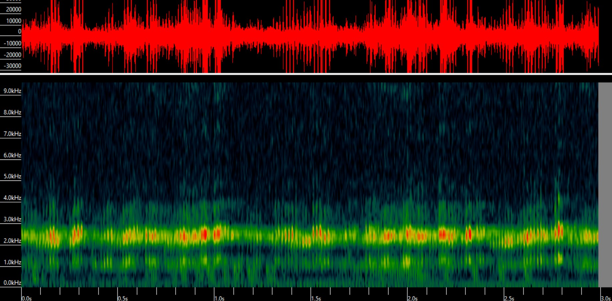
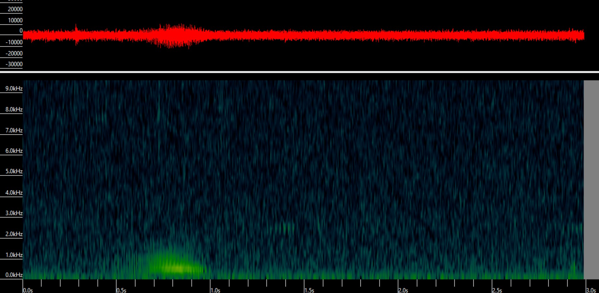

# Audio Data Examples

### Positive Examples

**High Quality (clear, prominent call)**

<figure><figcaption></figcaption></figure>



***

**Medium Quality (call present with moderate noise - not overlapping with signal)**

<figure><figcaption></figcaption></figure>



***

**Low Quality (faint, distant, or heavily masked call)**

<figure><figcaption></figcaption></figure>



***

#### Call Type Examples

**Grunt Call**

<figure><figcaption></figcaption></figure>



**Growl Call**

<figure><figcaption></figcaption></figure>



**Both Call Types**

<figure><figcaption></figcaption></figure>
