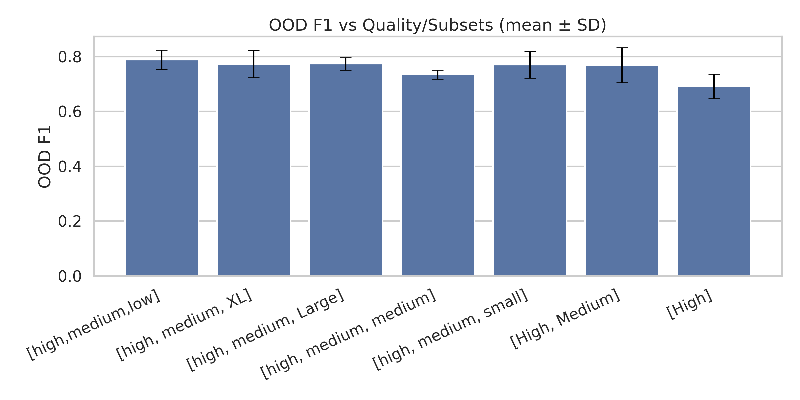
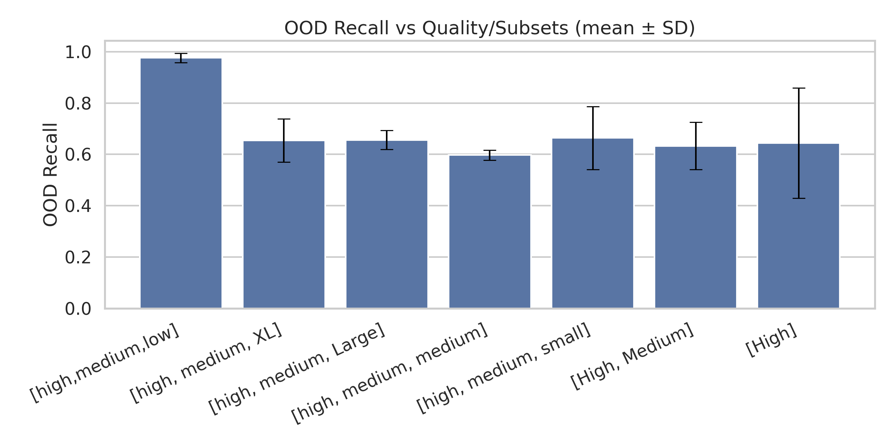
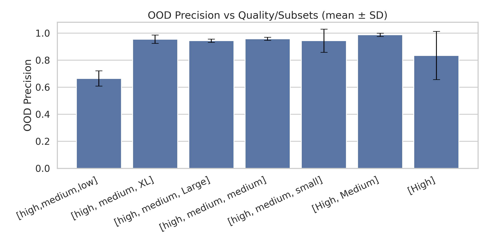

# Positive Datasets & Subsets

The graphs below describe a few telling metrics for our positive data subsets. Graphs are ordered from all positive data included on the left, decreasing the amount of data by dropping the lowest quality data first, until reaching only high quality data on the right. More information about datasets can be found in my [Audio Data Split Design](../../audio-data-split-design/).

All data experiments shown in these graphs used balancing (negative class down sampled to match positive size), and no use of the custom validation set.


The data used in these graphs can be found below:




<figure><figcaption></figcaption></figure>

<figure><figcaption></figcaption></figure>

<figure><figcaption></figcaption></figure>

### Evaluation

These graph reveal two important pieces of information:

* Introducing the full set of low quality data significantly increases Recall, and decreased Precision.
* Selecting for only high quality data creates much less stable experiments, with a large standard deviation. Training with only high quality data also tend to perform slightly worse overall across the metrics computed.

We can see that while increasing the quantity of data is largely beneficial to model performance, it is still important to use quality data when attempting to train a precision-focused model.


All data in this section was synthesized from [stage 6](../../staged-sweeps-design/stage-6-data-composition.md) and [stage 9](../../staged-sweeps-design/stage-9.md).


