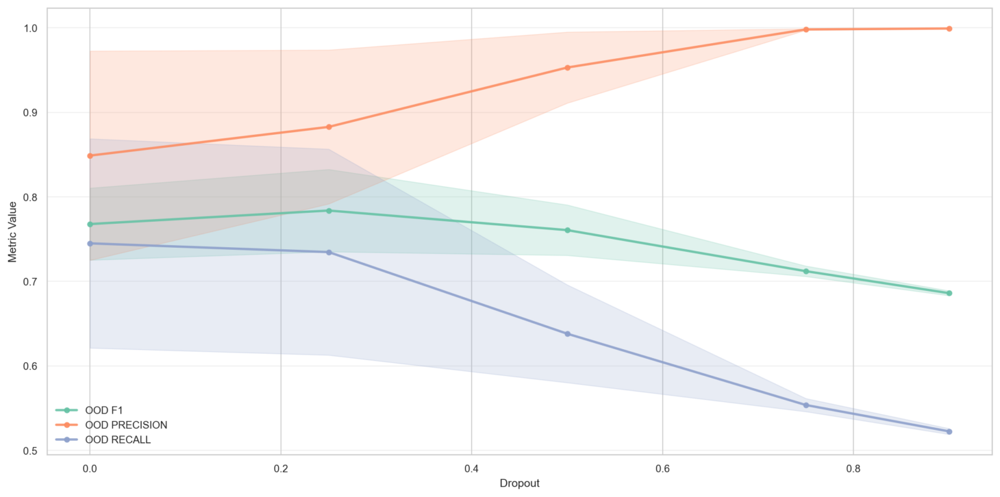

# Dropout

Dropout had a strong effect on model performance via a precision-recall tradeoff. As dropout increases, precision increases and recall decreases. This pattern is consistent with dropout's regularization mechanism - it forces the model to be more conservative by randomly dropping activations, which naturally shifts the decision boundary toward higher precision / lower recall.

<figure><figcaption></figcaption></figure>

We also see the standard deviation between experiments decrease as we increase the dropout. For this reason we will likely take a dropout of .25 for its slightly tighter standard deviation and increased precision, without collapsing recall.


