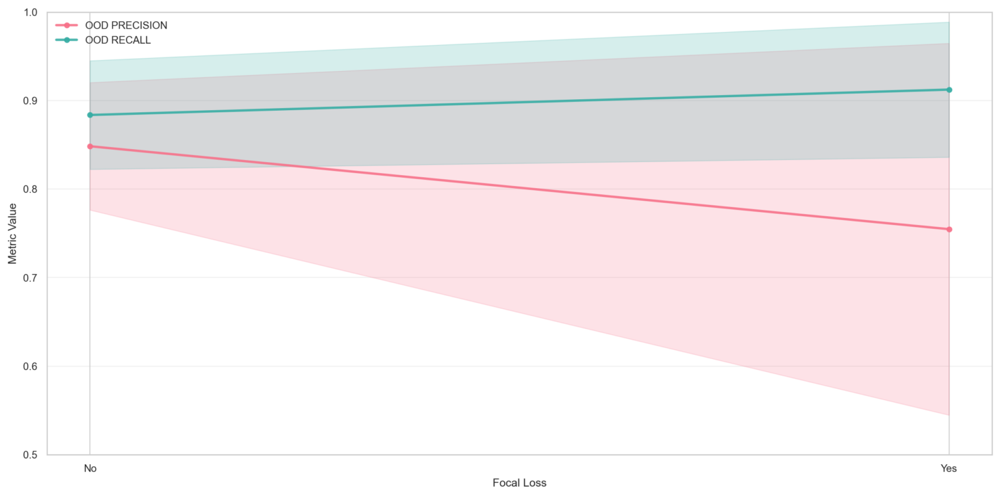

# Focal loss

The introduction of focal loss shows a weak precision-recall tradeoff. While the correlation is not strong, we will likely avoid using Focal loss to avoid dropping Precision and increasing instability.

The graph below uses unbalanced \[high,medium,low] data.

<figure><figcaption></figcaption></figure>


