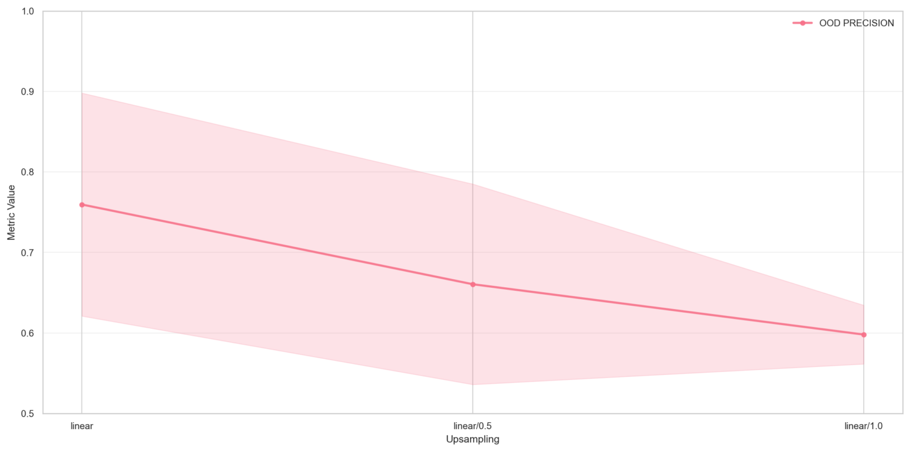
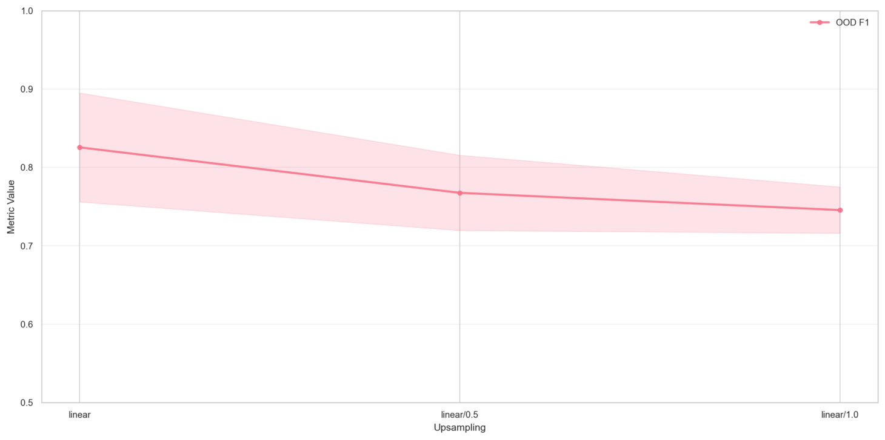

# Upsampling

The graphs below display the results of linear upsampling on datasets \[high, medium, low] with balancing = false. On the x-axis the leftmost datapoint represents no upsampling, the middle represents an upsampling ratio of 0.5, the rightmost represents an upsampling ration of 1.0.

#### Precision

<figure><figcaption></figcaption></figure>

#### Recall

<figure><figcaption></figcaption></figure>

#### F1

<figure><figcaption></figcaption></figure>

Increasing upsampling shifts the precision–recall balance toward higher recall at the expense of precision. With recall approaching its upper limit, additional upsampling yields diminishing returns and leads to a net decrease in F1.

The same trends were observed in the mean and smote methods for upsampling.


