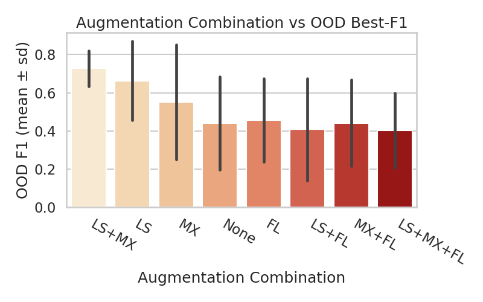
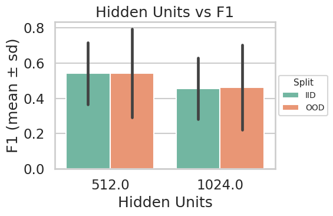

# \[Archive] Stage 2 - Data Augmentation

#### Overview

This combined sweep extended the pure-augmentation experiment (Stage 2) by testing those same augmentations across two hidden-unit scales (512, 1024) and two learning-rate regimes (5 × 10⁻⁴, 1 × 10⁻³).\
The goal was to confirm that the label-smoothing + mixup gains persist under capacity and learning-rate variation and to detect any interactions.

***

#### Top Configurations (Mean ± Std across 3 seeds)

<table><thead><tr><th width="137.3333740234375" align="center">Hidden Units</th><th width="100.66668701171875" align="center">LR</th><th width="160.00006103515625" align="center">Label Smoothing</th><th align="center">Mixup</th><th align="center">Focal Loss</th><th align="center">OOD F1 ± SD</th><th>Precision</th><th>Recall</th><th>IID F1 ± SD</th></tr></thead><tbody><tr><td align="center"><strong>512</strong></td><td align="center"><mark style="color:$primary;"><strong>1e-3</strong></mark></td><td align="center"><mark style="color:$success;">True</mark></td><td align="center"><mark style="color:$danger;">False</mark></td><td align="center"><mark style="color:$danger;">False</mark></td><td align="center">0.81 ± 0.02</td><td>0.74</td><td>0.89</td><td>0.72 ± 0.10</td></tr><tr><td align="center"><strong>512</strong></td><td align="center"><strong>5e-4</strong></td><td align="center"><mark style="color:$success;">True</mark></td><td align="center"><mark style="color:$success;">True</mark></td><td align="center"><mark style="color:$danger;">False</mark></td><td align="center">0.78 ± 0.09</td><td>0.70</td><td>0.89</td><td>0.71 ± 0.05</td></tr><tr><td align="center"><strong>512</strong></td><td align="center"><mark style="color:$primary;"><strong>1e-3</strong></mark></td><td align="center"><mark style="color:$success;">True</mark></td><td align="center"><mark style="color:$success;">True</mark></td><td align="center"><mark style="color:$danger;">False</mark></td><td align="center">0.72 ± 0.04</td><td>0.57</td><td>0.95</td><td>0.55 ± 0.04</td></tr><tr><td align="center"><mark style="color:$success;"><strong>1024</strong></mark></td><td align="center"><strong>5e-4</strong></td><td align="center"><mark style="color:$success;">True</mark></td><td align="center"><mark style="color:$success;">True</mark></td><td align="center"><mark style="color:$danger;">False</mark></td><td align="center">0.71 ± 0.07</td><td>0.61</td><td>0.88</td><td>0.59 ± 0.06</td></tr><tr><td align="center"><strong>512</strong></td><td align="center"><strong>5e-4</strong></td><td align="center"><mark style="color:$success;">True</mark></td><td align="center"><mark style="color:$danger;">False</mark></td><td align="center"><mark style="color:$danger;">False</mark></td><td align="center">0.69 ± 0.11</td><td>0.67</td><td>0.74</td><td>0.66 ± 0.10</td></tr></tbody></table>

<figure><figcaption></figcaption></figure>

#### Interactions and Patterns

**Augmentation Effects**

* Label smoothing consistently lifted OOD F1 and stabilized seed variance.
* Mixup contributed positively only when combined with smoothing; otherwise, it often over-regularized.
* Focal loss continued to reduce recall and will be dropped from further testing.

***

<figure><figcaption></figcaption></figure>

**Capacity & Learning Rate**

* 512 HU models remained the sweet spot for stable performance.
* 1024 HU gave no meaningful improvement and increased variance.
* LR = 1e-3 slightly outperformed 5e-4 when smoothing was ON and mixup OFF (fast convergence helped generalization).

**IID vs OOD Behavior**

* IID F1 trailed OOD F1 slightly, showing the augmentations prevented memorization and shifted the model toward broader generalization.
* Across top configs, IID F1 ≈ 0.70 ± 0.05 confirmed stability and no severe overfitting.

***

#### Takeaways

* **Best overall:** 512 HU, dropout 0.25, LR 1e-3, label smoothing ON, mixup OFF, focal loss OFF.
  * Highest OOD F1 = **0.81 ± 0.02**, precision ≈ 0.74, recall ≈ 0.89.
* **Best combined augmentation:** 512 HU, LR 5e-4, label smoothing + mixup — OOD F1 = 0.78 ± 0.09, recall ≈ 0.89.
* **Worst performers:** all focal-loss configs (F1 ≤ 0.46).
* **Trends:** smoothing dominates; mixup provides marginal additional robustness; higher capacity yields no consistent benefit.

***

#### Promotion to Stage 3

Because smoothing + mixup remains strong and stable across both tested learning rates and capacities, we fix those augmentations as **Stage 3 anchors**.\
The next sweep will explore **data-balancing (upsampling)** effects on recall and precision using this stabilized augmentation baseline.
