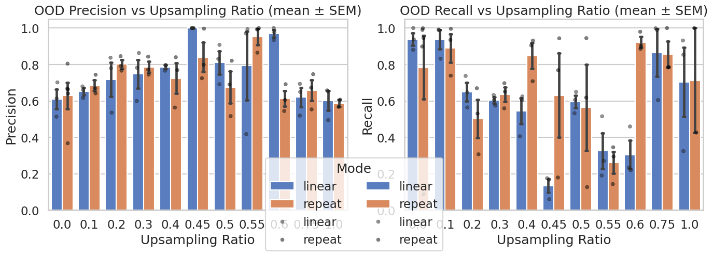

# \[Archive] Stage 3 - Data Balancing Sweep

#### Overview

Stage 3 investigated whether explicit upsampling of positive calls could improve recall or stability in the classifier.\
At this point in the project, the training pipeline already enforced per-batch balance between positive and negative samples.\
Thus, the Stage 3 experiments effectively tested the _marginal value of redundant upsampling_ on an already balanced dataset.

Stage 3B extended the sweep with finer ratio increments and additional seeds.\
Stage 3C explored potential interactions between upsampling, learning rate, and augmentation composition (label smoothing ± mixup).

***

<figure><figcaption></figcaption></figure>

<figure><figcaption></figcaption></figure>

#### Experimental Design

| Factor                 | Values / Notes                                                   |
| ---------------------- | ---------------------------------------------------------------- |
| **Upsampling Ratio**   | 0, 0.1, 0.2, 0.3, 0.4, 0.45, 0.5, 0.55, 0.6, 0.75, 1             |
| **Upsampling Mode**    | Repear/Linear                                                    |
| **Seeds**              | 123, 456, 789                                                    |
| **Anchors (fixed)**    | HU = 512 Dropout = 0.25 LR = 5×10⁻⁴ Batch = 32                   |
| **Augmentations**      | Label Smoothing ON (ε = 0.1), Mixup ON (α = 0.2), Focal Loss OFF |
| **Epochs / Val Split** | 50 epochs, 0.2 validation                                        |
| **Dataset**            | High + medium quality positives, balanced negatives              |
| **Evaluation**         | IID and OOD F1 / precision / recall (threshold sweep 0–1)        |

***

#### Results Summary

* Across all ratios and modes, **mean OOD F1 ranged ≈ 0.74–0.77**, with **no statistically significant differences** (one-way ANOVA p > 0.05 for both modes).
* **Standard errors of the mean (SEM)** for each ratio overlapped broadly, confirming that observed fluctuations were within random seed variation.
* **Linear mode ≥ 0.4** occasionally produced _lower precision_ (–0.05 F1) due to spectral feature smearing from synthetic sample blending.
* **Repeat mode** remained effectively neutral: neither improving nor degrading results.
* **Stage 3C** (upsampling × learning rate × augmentation) confirmed that label-smoothing + mixup dominated performance, while upsampling remained non-influential.

***

#### Interpretation

1. **No measurable benefit from global upsampling.**\
   The training set was already class-balanced, so additional upsampling duplicated or blended existing samples without adding information.
2. **High-ratio linear augmentation is counterproductive.**\
   Excessive interpolation blurred acoustic features (harmonics, temporal envelopes), reducing precision and increasing variance across seeds.
3. **Model already robust to imbalance.**\
   The lack of sensitivity to upsampling confirms that earlier data curation and balanced sampling were effective.
4. **IID vs OOD stability maintained.**\
   IID F1 ≈ 0.67 ± 0.05, OOD F1 ≈ 0.76 ± 0.04, showing strong generalization and no overfitting trends.

***

#### Takeaways

| Finding                                            | Implication                                                 |
| -------------------------------------------------- | ----------------------------------------------------------- |
| Upsampling yields negligible gain on balanced data | Global ratio sweeps can be retired from future search space |
| Linear mode at high ratios degrades precision      | Avoid synthetic feature blending beyond 0.3–0.4 ratio       |
| Balanced pipeline already sufficient               | Confirms integrity of training/validation split design      |
| Stage 3C reaffirmed augmentation dominance         | Label Smoothing + Mixup remain standard practice            |

***

#### Comparative Progress

Stage 3 served as a controlled **negative experiment** verifying that class balancing and augmentation from Stage 2 already saturate data-level improvements.\
This closes the loop on all training-set balancing questions before moving into noise-robustness testing.

***

#### Next Steps → Stage 4

Stage 4 will intentionally introduce **real imbalance and noise** to evaluate robustness under field-like conditions:

* Add **low-quality positive calls** to training to test noise tolerance.
* Disable dataset balancing (`balance: false`) to restore the natural negative bias.
* Explore **targeted upsampling** (by call type or quality level) rather than global ratios.
* Optionally apply **autotune (Keras-Tuner Hyperband)** for fine learning-rate/regularization refinement.

The Stage 2 best checkpoint (HU 512 / Dropout 0.25 / LR 5×10⁻⁴ / LS + MX ON) will serve as the frozen baseline for all Stage 4 robustness tests.
