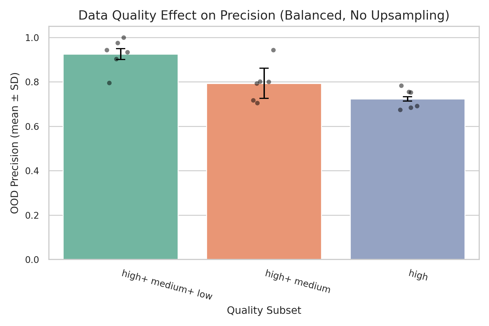
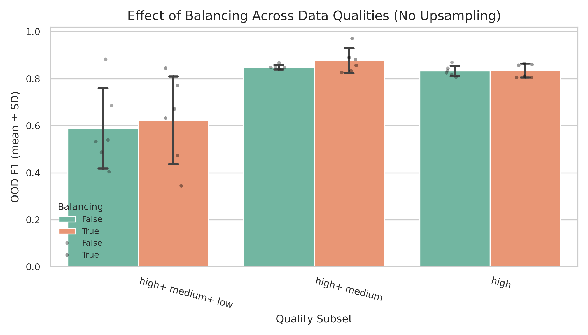

# \[Archive] Stage 4 - Data quality distributions

#### Objective

Stage 4 evaluated how **dataset composition** (quality subsets, class balance, and data-level rebalancing) affects classifier robustness and precision–recall stability.\
While Stages 1–3 optimized architecture and augmentation under controlled, balanced data, Stage 4 deliberately stressed the system by modifying data distributions to mimic field variability and imperfect labeling.

***

### Experimental Design

| Factor                      | Purpose                                            | Tested Levels                                              |
| --------------------------- | -------------------------------------------------- | ---------------------------------------------------------- |
| **Quality subset**          | Examine impact of including lower-quality audio    | `["high"]`, `["high","medium"]`, `["high","medium","low"]` |
| **Class balance**           | Evaluate importance of positive/negative balancing | `balance=True` vs `balance=False`                          |
| **Upsampling mode × ratio** | Test recovery of recall on unbalanced sets         | Mode = `repeat` or `linear`; Ratio = 0.0 – 0.5             |
| **Seeds**                   | Assess stability and reproducibility               | 3 random seeds per configuration                           |

A total of **108 runs** were completed\
Each configuration reused a fixed BirdNET architecture and augmentation profile:

* Hidden Units = 512
* Dropout = 0.25
* Learning Rate = 5e-4
* Label Smoothing + Mixup = ON
* Focal Loss = OFF

***

### Top configs overview

Top-performing Stage 4 configurations (mean ± SD over three seeds)

| Quality       | Balance | OOD F1 ± SD     | Precision ± SD | Recall ± SD | Upsampling   | Experiments       |
| ------------- | ------- | --------------- | -------------- | ----------- | ------------ | ----------------- |
| high + medium | Yes     | **0.90 ± 0.07** | 0.82 ± 0.11    | 1.00 ± 0.00 | repeat       | stage4\_037 – 039 |
| high + medium | Yes     | **0.88 ± 0.04** | 0.84 ± 0.09    | 0.94 ± 0.07 | linear / 0.5 | stage4\_052 – 054 |
| high + medium | No      | **0.87 ± 0.01** | 0.78 ± 0.02    | 0.98 ± 0.01 | linear / 0.5 | stage4\_070 – 072 |
| high + medium | No      | **0.87 ± 0.02** | 0.77 ± 0.03    | 1.00 ± 0.00 | repeat / 0.3 | stage4\_058 – 060 |
| high          | No      | **0.86 ± 0.05** | 0.77 ± 0.09    | 0.99 ± 0.01 | linear / 0.5 | stage4\_034 – 036 |

***

#### Data Quality

* Introducing low quality data had a significant effects of reducing recall, and increasing precision. On average it reduced mean f1 and broadened it's standard deviation.
* The imbalance of data among quality types should also be noted. In this experiment the data included the following quantities, with negatives balanced to match the total number of positives:
  * **High quality positives:** 626
  * **Medium quality positives:** 2,971
  * **Low quality positives:** 4,290
  * **Negatives**: 7,887
* Training on only high quality data had the effect of bringing slightly reduced mean f1, and precision - but at a tighter standard deviation across runs.

<figure><figcaption></figcaption></figure>

<figure><figcaption></figcaption></figure>

### Balancing (pos/neg)

Balance: when true, the training package builder will under sample the larger class (in my case negatives) so positives and negatives have equal counts. This sampling is deterministic (seeded) and applied before training-time upsampling (training\_args.upsampling\_\*), which is a separate mechanism passed through to the BirdNET-Analyzer training step.

Balancing the amount of negative samples to be in line with positive samples did not have a statistically significant effect on mean f1 across any of the data subsets. This can likely be contributed to a few factors:

* The large amount of training data yields plenty of positive examples even when unbalanced.
* Mix-up and Label-smoothing were used for all runs - helping regulate gradient bias from imbalance.
* The data imbalance ratio was only \~ 1 : 1.8 - which is not extreme to begin with.

<figure><figcaption></figcaption></figure>

### Upsampling

Upsampling does not show consistent improvement in f1 across any upsampling mode or ratio. A tradeoff of increased recall with decreased precision is shown in repeat upsampling with low quality data, which is not our intended behavior. This demonstrates that the dataset is sufficiently large and diverse for the model to converge properly without relying on artificial resampling or synthetic data generation.

| Quality                 | Mode   | Mean Δ F1  | Mean Δ Precision | Mean Δ Recall     |
| ----------------------- | ------ | ---------- | ---------------- | ----------------- |
| **high**                | linear | −0.008     | −0.012           | −0.000            |
| **high**                | repeat | −0.004     | −0.005           | −0.000            |
| **high + medium**       | linear | −0.007     | **+0.016**       | −0.026            |
| **high + medium**       | repeat | **−0.037** | −0.018           | −0.046            |
| **high + medium + low** | linear | **−0.043** | −0.033           | −0.037            |
| **high + medium + low** | repeat | **+0.056** | −0.070           | **+0.113 recall** |

***

### Looking Forward:

Neither Upsampling nor positive/negative balancing showed any statistically significant improvement of the performance of our models under any conditions. For this reason they will not be used moving forward in order to reduce variables.

Despite the introduction of low quality data reducing overall f1, it should still be further pursued for its ability to increase precision, as that is the metric we would like to select for to create a more effective tool for the field. Perhaps including a more balanced portion of low quality data could increase our precision, without collapsing recall as was happening in these runs.

***
